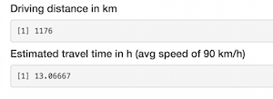

## The App

### A simple shiny application to help plan your European travel!

The European Travel Planner is designed to give you distances and time estimates for travel between major european cities. Forget using a map; just select an origin and a destination and voila! The app magically displays the distance in km and time in h based on an average speed of 90 km/h.

---

## Usage

Set your origin and destination cities:

 
 
Click 'Submit' and your distance and time are calculated:

 
 

---

## Data


The source data used for the application is the eurodist dataset in R. The official dataset description from R:


> The data give the road distances (in km) between 21 cities in Europe. The data are taken from a table in The Cambridge Encyclopaedia.

---

## Cities
Origin and destination cities can be any of the following:

Athens, Barcelona, Brussels, Calais, Cherbourg, Cologne, Copenhagen, Geneva, Gibraltar, Hamburg, Hook of Holland, Lisbon, Lyons, Madrid, Marseilles, Milan, Munich, Paris, Rome, Stockholm, Vienna

---

## Code Example

```r
library(stats)
data(eurodist)
distances <- as.matrix(eurodist)
# Distance (km)
distances["Paris", "Athens"]
```

```
## [1] 3000
```

```r
# Time (h)
distances["Paris", "Athens"] / 90
```

```
## [1] 33.33333
```
